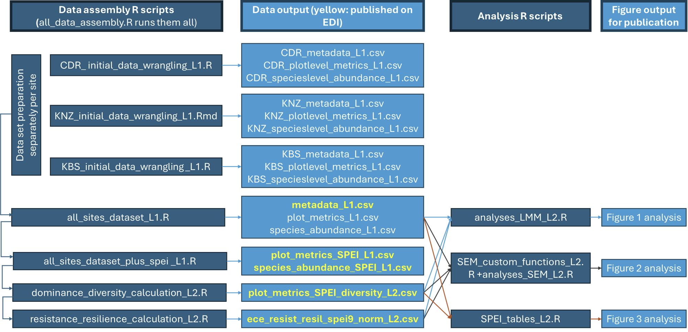

Open research: The data from this study are openly available in the Environmental Data Initiative data repository at <https://doi.org/10.6073/pasta/330082c127413fadc278a7657abad27f>.

## lter-grassland-rocks

# Introduction

This repository contains R scripts that organize, clean, harmonize, analyze, and plot data from a synthesis working group between three Long-Term Ecological Research (LTER) sites: Cedar Creek (CDR), Kellogg Biological Station (KBS), and Konza Prairie (KNZ). We looked at how the resistance and resilience of aboveground biomass to extreme climate events and anthropogenic drivers are shaped by multiple properties of plant community structure, including species richness, evenness, and dominant species.

# Workflow

## L1 Folder

Each LTER site has its own R script for initial merging and cleaning of datasets across that site that fit our criteria. There is a separate script that pulls in SPEI 3, 6, 9, and 12 for each site and combines them into one file. Following these, there is a script to combine all the sites' data into one file and another script that combines all the sites' data with the SPEI data into one file.

## L2 Folder

There is a script to calculate dominance and diversity (richness and evenness) and another to calculate resistance and resilience. For each analysis we carried out, there is a separate script (e.g. analyses_LMM_L2.R, analyses_sem_L2.R).

(Data_processing_workflow.png)

# Location of data

Some L1 data and all L2 data that are processed in the scripts in this repository are published as an EDI package (<https://doi.org/10.6073/pasta/330082c127413fadc278a7657abad27f>). In some scripts, the header may state that the data was input from Google Drive, which is an artifact of our data processing steps.

# Spatiotemporal extent and resolution

### Spatial extent:

• Three Long-Term Ecological Sites (LTER): Cedar Creek (East Bethel, Minnesota, USA; 45° 24' 3.6" N, 93° 12' 3.599" W), Kellogg Biological Station (Hickory Corners, Michigan, USA; 42° 23' 60" N, 85° 24' 0" W), Konza Prairie (Manhattan, Kansas, USA; 39° 5' 34.8" N, 96° 34' 30" W).

### Temporal extent:

• Years: 1982-2023

• We compiled data that contained at least five consecutive years of plant aboveground biomass and community composition data from the three LTER sites mentioned above.

# Usage

All analyses were conducted using R (R Core Team 2021).

# File naming conventions

### Scripts are organized into two folders: L1 and L2.

• L1 scripts clean and harmonize raw site-level data, then combine them into standardized datasets. Script names indicate the site or step in the wrangling process (e.g., CDR_initial_data_wrangling_L1.R, all_sites_dataset_plus_spei_L1.R).

• L2 scripts use the cleaned and merged data to calculate ecological metrics (diversity, dominance, resistance, resilience), run analyses (LMM, SEM), and produce summary tables or figures. These are named for the calculation or analysis they perform (e.g., dominance_diversity_calculations_L2.R, analyses_LMM_L2.R).

### Data files are organized into two groups: L1 and L2.

• L1 files are cleaned, site-level, and combined datasets, named for their contents (e.g., species_abundance_L1.csv, plot_metrics_SPEI_L1.csv). If a file does not specify a specific site, then that means all sites are included in that file.

• L2 files are analysis outputs, named after the metric or model (e.g., plot_metrics_SPEI_diversity_L2.csv, ece_resist_resil_spei9_norm_L2.csv).

# Contributers

Joshua Ajowele, Rachael Brenneman, Caitlin Broderick, Seraina Cappelli, Ashley Darst, Maowei Liang, Mary Linabury, Matthew Nieland, Maya Parker-Smith, Smriti Pehim Limbu, Rose Terry, Moriah Young, Max Zaret, Marissa Zaricor

# Contact Information

For inquiries related to the data and scripts, please contact Ashley Darst \@ @darstash\@msu.edu or Joshua Ajowele @jaajowele\@uncg.edu

# Funding

The long-term experiments and data collections at KNZ, CDR, and KBS were made possible by funding from the U.S. National Science Foundation Long-Term Ecological Research Program, including DEB-1234162, DEB-1831944, DEB-1440484, DEB-2025849, DEB-1832042, and DEB-2224712.
