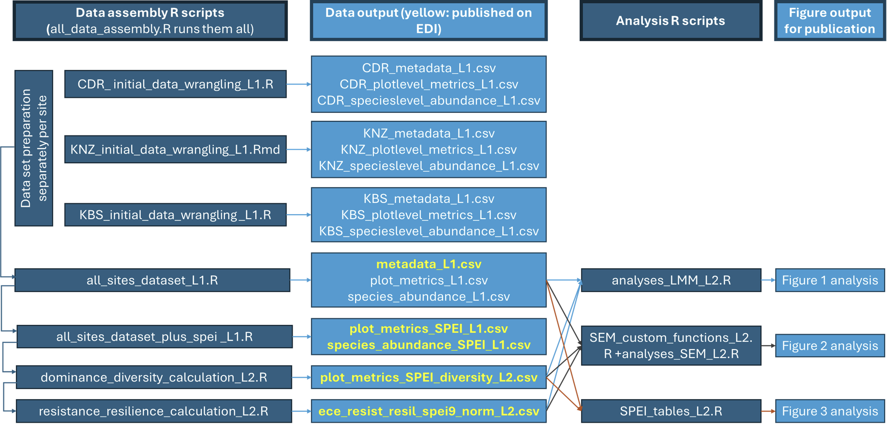

Open research: The data from this study are openly available in the Environmental Data Initiative data repository at <https://doi.org/10.6073/pasta/330082c127413fadc278a7657abad27f>.

## lter-grassland-rocks

# Introduction

This repository contains R scripts that organize, clean, harmonize, analyze, and plot data from a synthesis working group between three Long-Term Ecological Research (LTER) sites: Cedar Creek (CDR), Kellogg Biological Station (KBS), and Konza Prairie (KNZ). We looked at how the resistance and resilience of aboveground biomass to extreme climate events and anthropogenic drivers are shaped by multiple properties of plant community structure, including species richness, evenness, and dominant species.

# Workflow

## L1 Folder

Each LTER site has its own R script for initial merging and cleaning of datasets across that site that fit our criteria. There is a separate script that pulls in SPEI 3, 6, 9, and 12 for each site and combines them into one file. Following these, there is a script to combine all the sites' data into one file and another script that combines all the sites' data with the SPEI data into one file.

## L2 Folder

There is a script to calculate dominance and diversity (richness and evenness) and another to calculate resistance and resilience. For each analysis we carried out, there is a separate script (e.g. analyses_LMM_L2.R, analyses_sem_L2.R). R scripts in the archive subfolder are not needed for this project. There were exploratory scripts at best.

LTER Grassland Rock Data Processing Diagram

# Location of data

Data were saved to Google Drive in the folders L0, L1, and L2. L0 contained raw data uploaded from both publicly and not publicly available data obtained with permission from our three sites (see data provenance in EDI for the publicly available L0 data). L1 contained processed, harmonized data products. L2 contained data products resulting from calculations necessary for analyses (e.g., diversity and stability metrics).

All L1 and L2 data necessary for analyses are published as an EDI package (<https://doi.org/10.6073/pasta/330082c127413fadc278a7657abad27f>). In some scripts, the header may state that the data was input from Google Drive, which is an artifact of our data processing steps. The data from the EDI package should be saved in the same folder as the analyses_LMM_L2, SPEI_table_L2 and analyses_SEM_L2 R scripts.

# Spatiotemporal extent and resolution

### Spatial extent:

• Three Long-Term Ecological Sites (LTER): Cedar Creek (East Bethel, Minnesota, USA; 45° 24' 3.6" N, 93° 12' 3.599" W), Kellogg Biological Station (Hickory Corners, Michigan, USA; 42° 23' 60" N, 85° 24' 0" W), Konza Prairie (Manhattan, Kansas, USA; 39° 5' 34.8" N, 96° 34' 30" W).

### Temporal extent:

• Years: 1982-2023

• We compiled data that contained at least five consecutive years of plant aboveground biomass and community composition data from the three LTER sites mentioned above.

# Usage

Main analyses were conducted using R version 4.4.1 (2024-06-14) (R Core Team 2021).

Attached package versions: ggsignif 0.6.4, emmeans 2.0.1, ggforce 0.5.0, lavaan 0.6-21, piecewiseSEM 2.3.0.1, kableExtra 1.4.0, cowplot 1.2.0, patchwork 1.3.2, sjPlot 2.9.0, performance 0.15.3, GGally 2.4.0, car 3.1-3, carData 3.0-5, MuMIn 1.48.11, ggeffects 2.3.2, bbmle 1.0.25.1, DHARMa 0.4.7, lmerTest 3.2-0, lme4 1.1-38, Matrix 1.7-4, codyn 2.0.5, pacman 0.5.1, janitor 2.2.1, TNRS 0.3.6, gtools 3.9.5. lubridate 1.9.4, forcats 1.0.1, stringr 1.6.0, dplyr 1.1.4, purrr 1.2.1, readr 2.1.6, tidyr 1.3.2, tibble 3.3.1, ggplot2 4.0.1, tidyverse 2.0.0

Full session information (including dependency versions) is provided in `sessionInfo.txt`.

# File naming conventions

### Scripts are organized into two folders: L1 and L2.

• L1 scripts clean and harmonize raw site-level data, then combine them into standardized datasets. Script names indicate the site or step in the wrangling process (e.g., CDR_initial_data_wrangling_L1.R, all_sites_dataset_plus_spei_L1.R).

• L2 scripts use the cleaned and merged data to calculate ecological metrics (diversity, dominance, resistance, resilience), run analyses (LMM, SEM), and produce summary tables or figures. These are named for the calculation or analysis they perform (e.g., dominance_diversity_calculations_L2.R, analyses_LMM_L2.R).

### Data files are organized into two groups: L1 and L2.

• L1 files are cleaned, site-level, and combined datasets, named for their contents (e.g., species_abundance_L1.csv, plot_metrics_SPEI_L1.csv). If a file does not specify a specific site, then that means all sites are included in that file.

• L2 files are analysis outputs, named after the metric or model (e.g., plot_metrics_SPEI_diversity_L2.csv, ece_resist_resil_spei9_norm_L2.csv).

## Additional data information

-   All data set had at least 5 consecutive years of plant biomass and plant community data.
-   We excluded actively managed biodiversity and agricultural plots.
-   We excluded plots that were continually disturbed (e.g, tilled, irrigated, pesticides, grazed).
-   Nutrient addition plots were grouped together in our analyses based on the presence of nitrogen (N, NP, NPK+(contained NPK with micronutrients), NPK)

Below are links to some source data that contributed to our Environmental Data Initiative (EDI) package . [*https://portal.edirepository.org/nis/mapbrowse?scope=knb-lter-cdr&identifier=571&revision=9*](https://portal.edirepository.org/nis/mapbrowse?scope=knb-lter-cdr&identifier=571&revision=9){.uri}<https://portal.edirepository.org/nis/mapbrowse?scope=knb-lter-kbs&identifier=19&revision=85> [*https://portal.edirepository.org/nis/mapbrowse?scope=knb-lter-knz&identifier=100&revision=7*](https://portal.edirepository.org/nis/mapbrowse?scope=knb-lter-knz&identifier=100&revision=7){.uri}<https://portal.edirepository.org/nis/mapbrowse?scope=knb-lter-knz&identifier=55&revision=17> [*https://portal.edirepository.org/nis/mapbrowse?scope=knb-lter-knz&identifier=127&revision=5*](https://portal.edirepository.org/nis/mapbrowse?scope=knb-lter-knz&identifier=127&revision=5){.uri}<https://portal.edirepository.org/nis/mapbrowse?scope=knb-lter-knz&identifier=69&revision=22> [*https://portal.edirepository.org/nis/mapbrowse?scope=knb-lter-kbs&identifier=55&revision=49*](https://portal.edirepository.org/nis/mapbrowse?scope=knb-lter-kbs&identifier=55&revision=49){.uri}<https://portal.edirepository.org/nis/mapbrowse?scope=knb-lter-cdr&identifier=567&revision=9> [*https://portal.edirepository.org/nis/mapbrowse?scope=knb-lter-cdr&identifier=18&revision=12*](https://portal.edirepository.org/nis/mapbrowse?scope=knb-lter-cdr&identifier=18&revision=12){.uri}<https://portal.edirepository.org/nis/mapbrowse?scope=knb-lter-cdr&identifier=14&revision=11> [*https://portal.edirepository.org/nis/mapbrowse?scope=knb-lter-cdr&identifier=175&revision=10*](https://portal.edirepository.org/nis/mapbrowse?scope=knb-lter-cdr&identifier=175&revision=10){.uri}<https://portal.edirepository.org/nis/mapbrowse?scope=knb-lter-cdr&identifier=384&revision=11> [*https://portal.edirepository.org/nis/mapbrowse?scope=knb-lter-knz&identifier=106&revision=3*](https://portal.edirepository.org/nis/mapbrowse?scope=knb-lter-knz&identifier=106&revision=3){.uri}<https://portal.edirepository.org/nis/mapbrowse?scope=knb-lter-knz&identifier=91&revision=7> [*https://portal.edirepository.org/nis/mapbrowse?scope=knb-lter-knz&identifier=72&revision=22*](https://portal.edirepository.org/nis/mapbrowse?scope=knb-lter-knz&identifier=72&revision=22){.uri}<https://spei.csic.es/spei_database_2_10>

Some other source data we used were not publicly available, but we had permission to publish them as part of our harmonized data set published as an EDI package. See the Table S2 in our manuscript.

# Contributers

Joshua Ajowele, Rachael Brenneman, Caitlin Broderick, Seraina Cappelli, Ashley Darst, Maowei Liang, Mary Linabury, Matthew Nieland, Maya Parker-Smith, Smriti Pehim Limbu, Rose Terry, Moriah Young, Max Zaret, Marissa Zaricor

# Contact Information

For inquiries related to the data and scripts, please contact Ashley Darst @darstash\@msu.edu or Joshua Ajowele @jaajowele\@uncg.edu

# Funding

The long-term experiments and data collections at KNZ, CDR, and KBS were made possible by funding from the U.S. National Science Foundation Long-Term Ecological Research Program, including DEB-1234162, DEB-1831944, DEB-1440484, DEB-2025849, DEB-1832042, and DEB-2224712.
